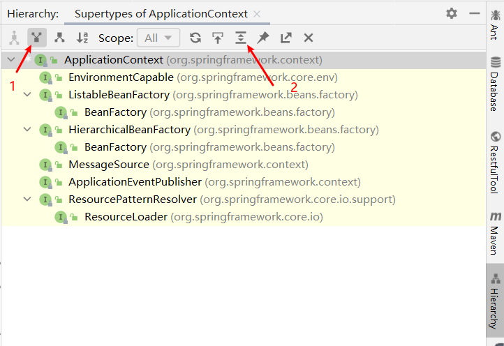
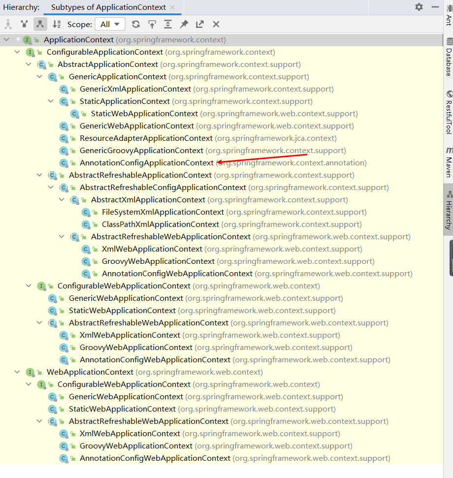

### 正题开始
#### getBean能取到我们往spring容器注入对象，所以从这个方法入手，ctrl+左击进入方法，类名为: BeanFactory
```java
public interface BeanFactory
```
#### 和我们想的有点差距，我们回到spring容器加载启动类：SpringStarter，在main方法中我们ctrl+左击进入ApplicationContext类
```java
public interface ApplicationContext extends EnvironmentCapable, ListableBeanFactory, HierarchicalBeanFactory,
		MessageSource, ApplicationEventPublisher, ResourcePatternResolver 
```
#### 我们使用IDEA的类分析工具，把光标选中当前类名，左上角——>Navigate——>Type Hierarchy，展开查看类的继承状态

### 很明显这个接口类继承自BeanFactory，我们再查看一下ApplicationContext有哪些实现类，很明显我们使用的AnnotationConfigApplicationContext位列其中

#### 小结
```text
    通过简单使用spring存取bean，我们可以知道BeanFactory是所有ApplicationContext的父接口，他们拥有的功能来自BeanFactory，并再BeanFactory的基础上不断
扩展，从而有了我们常用的spring通过xml或者注解方式配置使用spring容器的类(AnnotationConfigApplicationContext, ClassPathXmlApplicationContext)。
```
