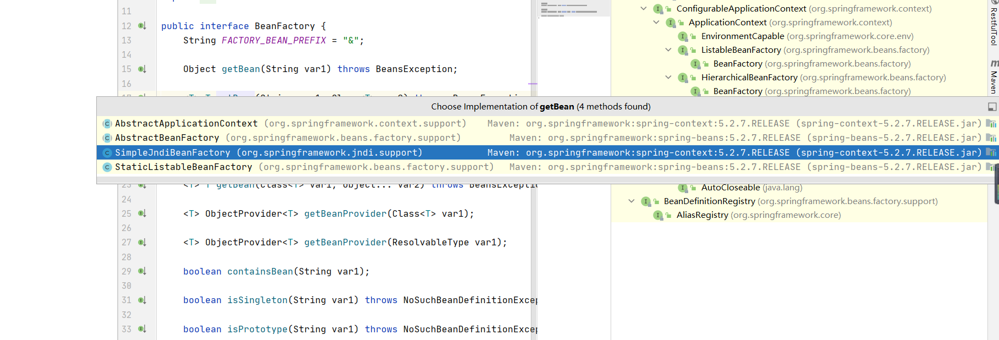
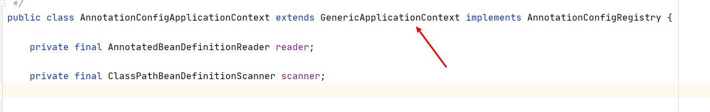
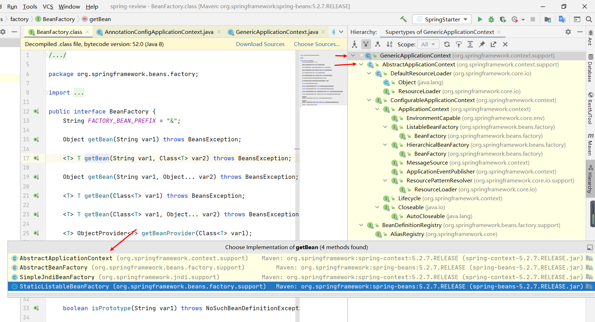
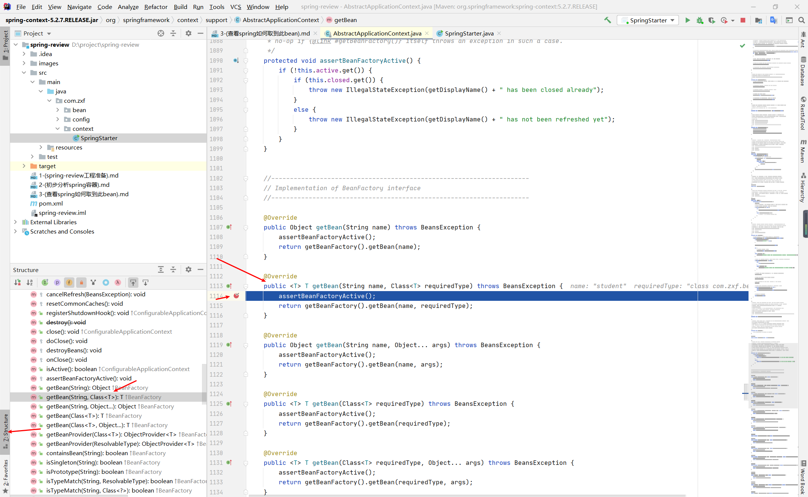
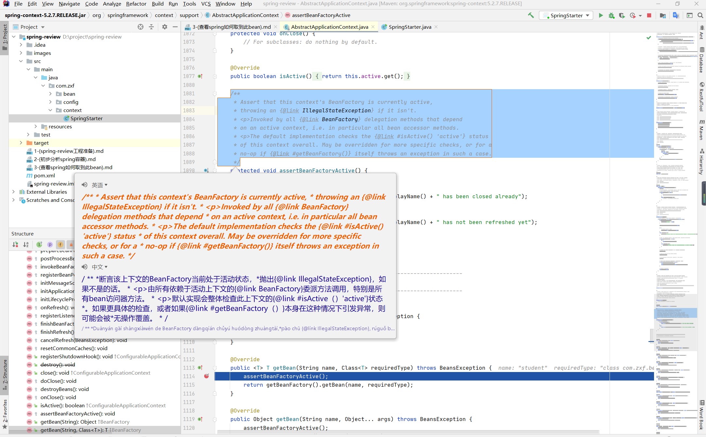
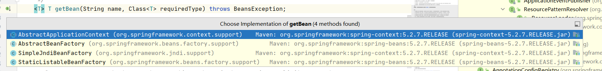
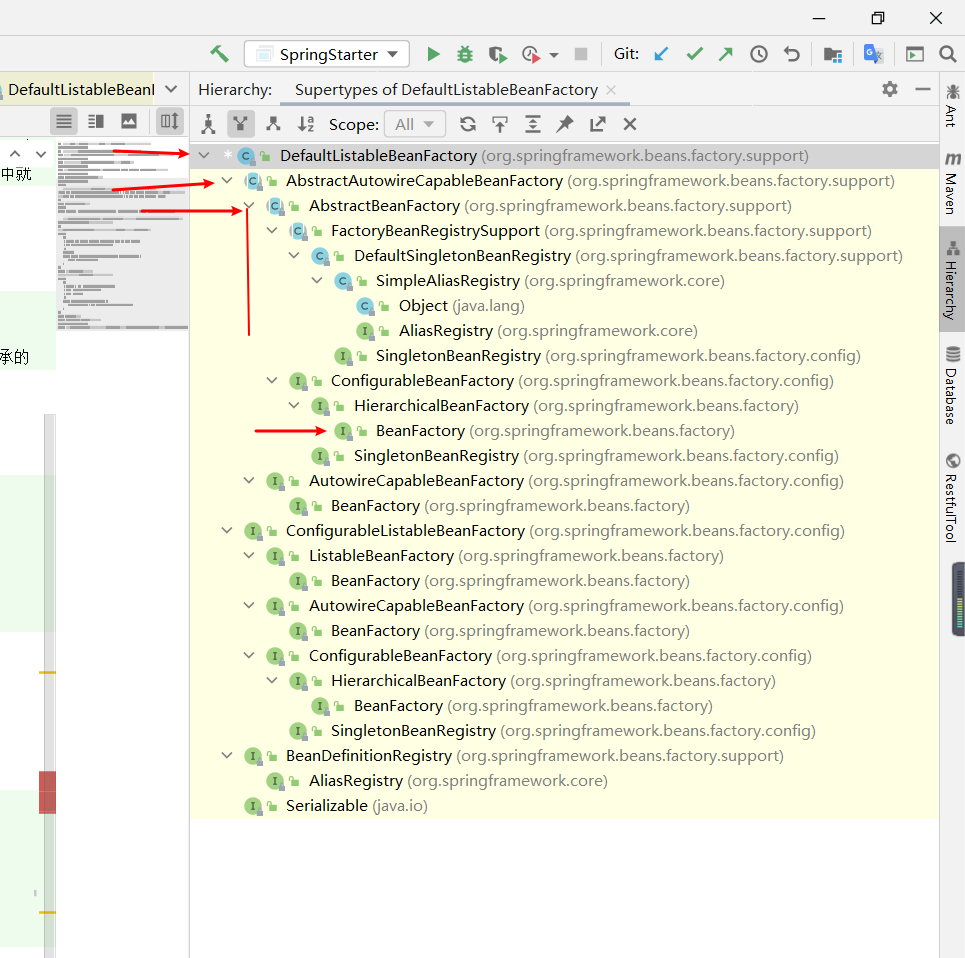

### 回到我们拿到bean的方法getBean，我们再从头开始，ctrl+左击进入到BeanFactory类，我们可以看到他又四个实现这个方法的类。

### 我们要如何知道我们使用的AnnotationConfigApplicationContext类取bean的能力来自于那个类呢?
#### 首先我们打开AnnotationConfigApplicationContext类可以看到其继承了一个GenericApplicationContext，当前能力绝对来自于它。

#### 分析此类的结构，看到其继承了AbstractApplicationContext，其类拥有了getBean方法。

#### 我们到AbstractApplicationContext类的getBean(String name, Class<T> requiredType)方法处打一个断点。

##### assertBeanFactoryActive();方法解析

```text
    根据英文意思，大概可以了解到这个方法是用来检测BeanFactory是否处于活动状态的方法，假如spring容器已经关闭(不处于活跃状态)则会抛出异常
【throw new IllegalStateException(getDisplayName() + " has been closed already");】，假如spring容器正在创建或者刷新中就
会抛出【throw new IllegalStateException(getDisplayName() + " has not been refreshed yet");】
```
##### getBeanFactory()方法解析
```text
public abstract ConfigurableListableBeanFactory getBeanFactory() throws IllegalStateException;

    可以看到AbstractApplicationContext类的getBeanFactory()方法是一个抽象接方法，AnnotationConfigApplicationContext继承的
GenericApplicationContext类实现了这个方法，我们需要从哪儿入手。
```
我们来到GenericApplicationContext类查看此方法，英文大概意思是：从这个context返回一个单例的BeanFactory对象。
```java
    /**
	 * Return the single internal BeanFactory held by this context
	 * (as ConfigurableListableBeanFactory).
	 */
	@Override
	public final ConfigurableListableBeanFactory getBeanFactory() {
		return this.beanFactory;
	}
```
###### 这个beanFactory是从哪里来的呢？
我们查看这个类的构造方法，我们可知beanFactory在构造器方法就进行了初始化赋值。
```java
	/**
	 * Create a new GenericApplicationContext.
	 * @see #registerBeanDefinition
	 * @see #refresh
	 */
	public GenericApplicationContext() {
		this.beanFactory = new DefaultListableBeanFactory();
	}
```
##### getBean()方法解析
###### beanFactory的getBean方法有四个实现类。

###### 综合上getBeanFactory()方法的分析，我们可以知道，beanFactory的实现指向DefaultListableBeanFactory类，我们到DefaultListableBeanFactory进行解析此类结构

###### 由解析DefaultListableBeanFactory的结构我们可以知道，getBean方法实现是在AbstractBeanFactory类中，我们通过BeanFactory找到对应的实现方法
```java
    @Override
	public <T> T getBean(String name, Class<T> requiredType) throws BeansException {
		return doGetBean(name, requiredType, null, false);
	}
```
