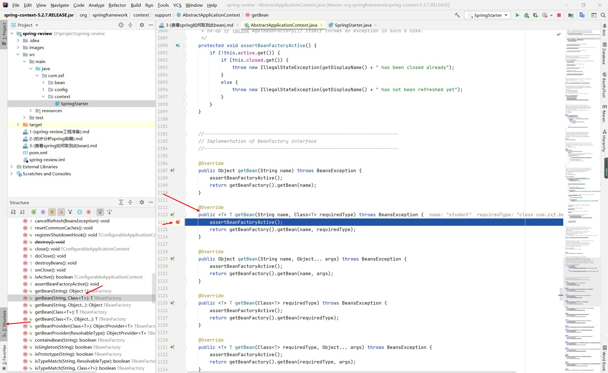

### 回到我们拿到bean的方法getBean，我们再从头开始，ctrl+左击进入到BeanFactory类，我们可以看到他又四个实现这个方法的类。

### 我们要如何知道我们使用的AnnotationConfigApplicationContext类取bean的能力来自于那个类呢?
#### 首先我们打开AnnotationConfigApplicationContext类可以看到其继承了一个GenericApplicationContext，当前能力绝对来自于它。

#### 分析此类的结构，看到其继承了AbstractApplicationContext，其类拥有了getBean方法。

#### 我们到AbstractApplicationContext类的getBean(String name, Class<T> requiredType)方法处打一个断点。

##### assertBeanFactoryActive();方法解析

